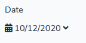
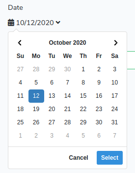
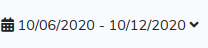
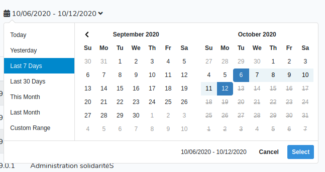

# DateRangePickerHelper

[By Sébastien L'haire](http://sebastien.lhaire.org)

`DateRangePickerHelper` is a Laravel library to provide an helper to initialize a single or double [DateRangePicker](https://www.daterangepicker.com/) calendar (based on
[jQuery](https://jquery.com) Javascript framework). Dates use
[Nesbot Carbon](https://carbon.nesbot.com/) on PHP side and [Moment.js](https://momentjs.com/) on Javascript side.

Single date picker appears as follow:





And range date picker appears as follow:





# Installation

1. `composer require seblhaire/daterangepickerhelper`

2. You can either download DateRangePicker on its website or install it with `npm`package manager if you compile your app Javascript files with [Laravel Mix](https://github.com/JeffreyWay/laravel-mix). Same choice for Bootstrap, jQuery and Moment.  `npm install jquery daterangepicker moment bootstrap`.

3. Composer will automatically link the package with Laravel. But you still can explicitely add provider and facade to your `config/app.php`:
```php
  'providers' => [
    ...
      Seblhaire\DateRangePickerHelper\DateRangePickerHelperServiceProvider::class,
      ...
    ],
    'aliases' => [
        ...
        'DateRangePickerHelper' => Seblhaire\DateRangePickerHelper\DateRangePickerHelper::class,
      ]
```
4. Publish package (optionally).
``` sh
$ php artisan vendor:publish
```
5. Add style to your app.scss file:

```
@import "~daterangepicker/daterangepicker.css";
```

6. add to app.js

```
global.jQuery = require('jquery');
var $ = global.jQuery;
var jQuery = global.JQuery;
window.$ = $;
window.jQuery = jQuery;
require('bootstrap');
global.moment = require('moment');
require('daterangepicker');
```

# Usage

Declare Facade in Controller headers:

```
use Carbon\Carbon;
use Seblhaire\DateRangePickerHelper\DateRangePickerHelper;
```

In a Controller function initialize object and pass it to the view. You can init several DateRangePickers in a view, but
make sure that calendar id is unique.

```php
...
$start = new Carbon('6 days ago');
$end = new Carbon;
$max = $end;
$min = null;
$calId = 'logCal';
$oCal = DateRangePickerHelper::init($calId, $start, $end, $min, $max, ['drops' => 'down', 'apply.daterangepicker' => $oTable->outputReload()]);
...
return view('myview', [
    ...
    'calendar' => $oCal,
    ...
  ]);  
```
Then in the Blade view, print your calendar like this:

`{!! $calendar->output() !!}`

If `$calendarElement` is set to `"mycal"`, the following line is printed, with options between rounded brackets:

```php
jQuery('#mycal').daterangepicker({ ... });
```

Alternatively, you can init it in controller without variable assignation and
use facade in view:

Controller:
```
$today = new Carbon;
$calId = 'numCal';
DateRangePickerHelper::init($calId, $today, $today, null, null, ['singleDatePicker' => true, 'cal_in_form' => true,
                'formlabel' => 'Date', 'usehiddeninputs' => false]);
```
View:

```
{!! DateRangePickerHelper::output('numCal') !!}
```

If your view contains only one DaterangePicker, you can omit calendar id:
```
{!! DateRangePickerHelper::output() !!}
```


## Config File

Config file `daterangepickerhelper.php` is available, either in package directory in vendor/seblhaire/daterangepickerhelper or in
your app config directory if you publish config. Parameters not language-dependent are in
`default` section.  Language-dependant parameters are in `language` section.

## Parameters

* `$calendarElement`: **mandatory** id of `<div>` element containing current date(s) selected in calendar, where you can click to open date selector.
* `$start`, `$end`: **mandatory** \Carbon\Carbon objects: initial period selected on calendar opening. Both dates can be the same.
* `$min`, `$max`: \Carbon\Carbon objects: boundary dates. Null if no boundary. Users will not be able to select a date before `$min` or after `$max`.
* `$options`: array of options among:
  * main used:
    * `singleDatePicker`: calendar selects one date instead of date range. Default: `false`.
    * `showISOWeekNumbers` or `showWeekNumbers`: adds week numbers in calendar. If first option is set to `true`, weeks will be in ISO format. If second option is `true`, weeks will be shown in US format. If none of them is true, then week numbers will not be shown. Default settings depend on locale.
    * `timePicker`: add dropdowns to select time in addition to dates. Default `false`.
      * `timePicker24Hour`: displays hours in format 24. Default `true`.
      * `timePickerSeconds`: add seconds to time. Default `false`.
      * `timePickerIncrement`: minutes increment in dropdown. Default `1`.
    * `weeklabel`: Very short label for week number column. Abreviation is recommended. Default translation key `calendar::messages.weeklabel` `W`.
    * `firstday`: first day of week. 0 = sunday, 1 = monday, etc. Default depends on locale.
    * `usehiddeninputs`: sets whether we put selected date(s) (and time) in the following hidden input/s. Default: `true`.
      * `hiddeninputstart`: name of input for start date. Default: `'startdate'`.
      * `hiddeninputend`: name of input for end date (if double date calendar). Default: `'enddate'`.
  * date format: Carbon formats are used to initialize calendars. Moment.js formats are used on new date selection. We need both formats. In order to facilitate configuration, we define several versions depending on preceding parameters, in order to format a correct date, with or without time, with or without seconds:
    * **momentinput**: Momentjs format to fill hidden inputs (see `usehiddeninputs`). Choices are `'momentinputdate'` or `'momentinputdatetime'`.
    * **carboninput**: Carbon format to fill hidden inputs (see `usehiddeninputs`). Choices are `'carboninputdate'`  or `'carboninputdatetime'`.
    * **carbonformat**: Carbon format to initialize dates next to calendar icon. Choices are `'carbonformat'`,
    `'carbonformattime'` or `'carbonformattimeseconds'`.
    * **formatdisplay**: Momentjs format to display dates. Choices are `'formatdisplay'`,
    `'formatdisplaytime'` or `'formatdisplaytimeseconds'`.
  * other options:
    * `caldivclass`: calendar div class. Default `"form-group cal-selector"`.
    * `icon`: calendar icon (default: [FontAwesome](https://fontawesome.com/) `'<i class="fas fa-calendar-alt"></i>`).
    * `opens`: (`'left'`/`'right'`/`'center'`) direction where calendars opens in respect to the `<div>` it is attached to. Default `right`.
    * `drops`: (`'down'`/`'up'`/`'auto'`) vertical direction where calendars open. Default: `auto`.
    * `maxSpan`: `moment` function which sets the max span between start and end date (eg: `"day": 7`). Default: no value.
    * `minYear`, `maxYear`: minimum and maximum years to display in dropdowns.
    * `fillhiddeninputsfunction`: Javascript statements to be put in Datepicker callback function which is run after a new date range (or a new date for single Datepicker) is set by `Apply` button. This callback function has 3 arguments `function(start, end, label)`. `start` and `end` are Moment objects. `label` is a string which contains the date range label used, cf `range` below. Defaults:
      * if you fill this option, your statements will be executed.
      * if this option is empty and `usehiddeninputs` option is true, hidden date inputs are filled with a date (+ time if applicable) in Mysql format (Y-m-d, Year-month-date, 2019-12-24 is December 24th 2019) and date or date range in human readable format next to calendar icon is replaced.
      * otherwise callback function is empty.
    * `dateseparator`: string used to separate dates of a range. Default `' - '`.
    * `daysofweek`: array of short labels, starting from sunday: ['Su', 'Mo', ... 'Sa'].
    You can either provide your own array or modify/add translation keys,  `calendar::messages.day0` to `calendar::messages.day6`. Cf [below](#translation_keys).
    * `monthnames`: array of month names ['January' ... 'December']. You can either provide your own array or modify/add translation keys,  `calendar::messages.month01` to `calendar::messages..month12`. Cf [below](#translation_keys).
    * `ranges`: array of ranges to set double calendar. First value is a label. Second value is an array with two momentjs functions to set values. Labels can be strings or translation key. Cf [below](#translation_keys).
    * `applylabel`: button label  to select date/range. Default_translation key `calendar::messages.applylabel`: `'Select'` Cf [below](#translation_keys).
    * `cancellabel`: cancel button label, default_translation key `calendar::messages.cancellabel` `'Cancel'`. Cf [below](#translation_keys).
    * `fromlabel`: Label before range begin date. Default translation key   `calendar::messages.fromlabel` `'From'`. Cf [below](#translation_keys).
    * `tolabel`: Label before range end date. Default translation key  `calendar::messages.tolabel` `'To'`. Cf [below](#translation_keys).
    * `customrange`: Label for custom range select. Default translation key  `calendar::messages.customrange` `'Custom range'`. Cf [below](#translation_keys).
    * `inform`: calendar can be inserted in a form. If true, calendar is included in a  `<div>` and preceded by a label (cf option `formlabel`). Default `true`.
    * `formdivclass`: if `inform` is set, this option sets class of `<div>`.
    * `formlabel`: if `inform` is set, this option sets class of `<label>`.
    * `alwaysShowCalendars`: when ranges are set (cf above), calendars are hidden by default unless you select `"Custom ranges"`. If you set  `alwaysShowCalendars` to true, calendars will be always visible. Default: `true`.
    * `showDropdowns`: Put month and years in dropwdowns. Default `false`.
    * `autoApply`: Hide Apply and Cancel  buttons and set dates as soon as two dates are selected. Default `false`.
    * `linkedCalendars`: both calendars always are in contiguous month if set true. Default: `false`.
    * `buttonClasses`: classes for buttons. Default: `"btn btn-sm"`,
    * `applyButtonClasses`: class for apply button. Default: `"btn-primary"`.
    * `cancelButtonClasses`: class for cancel button. Default: `"btn-default"`.
    * `apply.daterangepicker`: content of listener for event `"apply.daterangepicker"`
    triggered when the apply button is clicked, or when a predefined range is clicked.
      ```
      $('#daterange').on('apply.daterangepicker', function(ev, picker) {
        console.log(picker.startDate.format('YYYY-MM-DD'));
        console.log(picker.endDate.format('YYYY-MM-DD'));
      });
      ```
      Default empty.
  * `cancel.daterangepicker`: content of listener for event `"apply.daterangepicker"`
  triggered when the cancel button is clicked. Default empty. Cf `apply.daterangepicker`.
  * `show.daterangepicker`: content of listener for event `"show.daterangepicker"`
  triggered when the picker is shown. Default empty. Cf `apply.daterangepicker`.
  * `hide.daterangepicker`: content of listener for event `"hide.daterangepicker"`
  triggered when the picker is hidden. Default empty. Cf `apply.daterangepicker`.
  * `showCalendar.daterangepicker`: content of listener for event `"showCalendar.daterangepicker"`
  triggered when the calendar(s) are shown. Default empty. Cf `apply.daterangepicker`.
  * `hideCalendar.daterangepicker`: content of listener for event `"hideCalendar.daterangepicker"`
  triggered when the calendar(s) are hidden. Default empty. Cf `apply.daterangepicker`.


## Translation keys

Laravel loads config files very early in process. Therefore config files cannot contain `__('translation.key')`. In order to solve this issue, we made an helper either to print directly strings or to send translation key to translation helper. Translation keys can be delimited by character \#
 Ex: `"#formsbootstrap::messages.required#"`.

 Feel free to translate keys in your own language and either to send it to the author or to do a merge request on GitHub.

## Helpers

So far you have just initialized `DateRangePickerHelper`. But in your `JS` code, you need to retrieve new dates or date ranges set by your app user and/or to change dates dynamically, e.g. after you retrieve object from databases. `DateRangePicker` comes with methods to get and set new dates, but it is not easy to use, as shown here:

```php
jQuery('#mycal').data('daterangepicker').startDate.format('YYYY-MM-DD');
```
You have to remember the id of `<div>` tag that the `DateRangePicker` is attached to and to format dates with `Moment` syntax. However in most cases, you use `DateRangePickerHelper` with standard date format which has been already set in default options. Therefore we have set getters and setters.

### Getters

By default, your `DateRangePicker` will be inserted in a form. Therefore, you can retrieve all form values e.g. with `jQuery('form').serialize()`. Alternatively, date can be retrieved by e.g. `jQuery('#startdate').val()`. If calendar is not in a form, date value can be retrieved by the complex statement above. No need to figure out how your calendar is set, `DateRangePickerHelper` comes with two getters:

* getStartDate()
* getEndDate()

These methods output the adequate JS statement to get a date according to your `DateRangePickerHelper` settings. In the following example, in your blade template, if your `DateRangePickerHelper` is passed to variable `$calendar`, you may retrieve dates this way:


```php
jQuery.ajax({
    url: '/MongoUpdateBatch',
    encoding : 'utf8',
    type : 'post',
    data : {
      ...
      startdate: {!! $calendar->getStartDate() !!},
      enddate: {!! $calendar->getEndDate() !!},
      ...
    },
    success : function(res){
      ...
    }, ...
  });
```

You can also use facade to access these methods:

```
{!! DateRangePickerHelper::getStartDate('calId') !!},
{!! DateRangePickerHelper::getEndDate('calId') !!}
```

That's it.

### Setters

On the other side, your Ajax queries may load information in forms and other objects. Both DateRangePicker and label next to calendar icon must be changed. We provide several methods for that purpose.

* `setSingleCalendar($momentdate)` : sets both single calendar and label. `$momentdate` must be a `Moment` statement, eg. `moment(data.date)`, where `data.date` is a date in `MySql` format (`2020-09-10` or `2020-09-10 14:10:09`) ;
* `setDoubleCalendar($momentstartdate, $momentenddate)` : sets both double calendar and label, both parameters are `Moment` statements ;
* `setStartDate($momentdate)` : sets single calendar date or start date for double calendar ; parameter is a `Moment` statement ;
* `setEndDate($momentdate)` : sets end date for double calendar ; parameter is a `Moment` statement ;
* `setCalLabelSingle($momentdate)` : outputs date for label for single calendar ; parameter is a `Moment` statement ;
* `setCalLabelDouble($momentstartdate, $momentenddate)` : outputs date rang; parameters are `Moment` statements .

In the following example, in your blade template, if your `DateRangePickerHelper` is passed to variable `$calendar`, you may set dates this way:

```php
resetForm = function(){
  jQuery('#titre').val('');
  {!! $calendar->setSingleCalendar('moment()') !!}
}
loadForm = function(id){
    jQuery.ajax({
        url: "/getform",
        cache: false,
        encoding : 'utf8',
        type : 'post',
        data : {
            id: id,
            _token : "{{ csrf_token() }}"
        },
        dataType 	: 'json',
        success: function(data){
          jQuery('#titre').val(data.title);
          ...
          {!! $calendar->setSingleCalendar('moment(data.date)') !!}
          ...
        }
    });
}
```

With the Facade, use the followig methods. `$calId` parameter can be ommited if view has only one DateRangePicker.

* `DateRangePickerHelper::setSingleCalendar($momentdate, $calId)`
* `DateRangePickerHelper::setDoubleCalendar($momentstartdate, $momentenddate, $calId)`
* `DateRangePickerHelper::setStartDate($momentdate, $calId)`
* `DateRangePickerHelper::setEndDate($momentdate, $calId)`
* `DateRangePickerHelper::setCalLabelSingle($momentdate, $calId)`
* `DateRangePickerHelper::setCalLabelDouble($momentstartdate, $momentenddate, $calId)`

# Questions? Contributions?

Feel free to send feature requests or merge request to the author or simply to ask questions.
